# 🏦 AI-Powered Customer Churn Prediction & Analytics System

A production-ready, end-to-end machine learning application that predicts bank customer churn using
**6 classical ML algorithms + a Deep Learning ANN**, wrapped in a **12-page, fully tabbed Streamlit
dashboard** with **Explainable AI (SHAP)**, **KMeans customer segmentation**, **lift/gain model
diagnostics**, **CSV/Excel/PDF reporting**, a **data validation hub**, interactive **AgGrid** tables,
and an optional **REST API**.

This project extends the original research notebook (in `notebooks/`, with all modeling logic intact
— see note below) into a full production system suitable for a **Final Year Major Project, GitHub
portfolio, resume, and technical interviews**.

> *"Developed a deep learning-based customer churn prediction system using Python, TensorFlow/Keras,
> and Artificial Neural Networks (ANN) to identify customers at risk of leaving and support proactive
> retention strategies. Built a 12-page interactive analytics dashboard with executive reporting,
> KMeans customer segmentation, explainable AI, lift/gain model diagnostics, and multi-format
> (CSV/Excel/PDF) business reporting to enable data-driven retention decisions."*


---

## 📌 Project Overview

| | |
|---|---|
| **Problem** | Predict whether a bank customer will churn (leave the bank) |
| **Dataset** | `Churn_Modelling.csv` — 10,000 bank customers, 14 attributes |
| **Models** | Logistic Regression, KNN, Naive Bayes, Random Forest, XGBoost, ANN (TensorFlow/Keras) |
| **Segmentation** | KMeans clustering → 4 business personas by value & risk |
| **Interface** | 12-page, tabbed Streamlit dashboard + optional FastAPI REST service |
| **Explainability** | SHAP (global summary, local waterfall & force plots) |
| **Reporting** | Downloadable CSV, Excel (multi-sheet), and PDF reports |
| **Deployment** | Fully modular `src/` package, ready for Docker / Streamlit Community Cloud / any cloud VM |

---

## 🗂️ Project Structure

```
Customer-Churn-System/
│
├── app.py                     # Streamlit entry point — tabbed Executive Dashboard
├── requirements.txt
├── README.md
├── LICENSE
├── .gitignore
│
├── assets/
│   └── screenshots/            # Dashboard screenshots (see Screenshots section below)
│
├── dataset/
│   └── Churn_Modelling.csv    # Original dataset
│
├── models/                    # Saved model artifacts (generated by training.py)
│   ├── logistic_regression.pkl
│   ├── knn.pkl
│   ├── naive_bayes.pkl
│   ├── random_forest.pkl
│   ├── xgb.pkl
│   ├── ann_model.keras
│   ├── scaler.pkl
│   ├── gender_encoder.pkl
│   ├── feature_order.json
│   ├── geography_categories.json
│   ├── model_metrics.json
│   └── ann_training_history.json
│
├── notebooks/
│   └── Bank_customer_churn_prediction.ipynb   # Original research notebook
│
├── src/                        # Core, reusable, documented Python package
│   ├── config.py                # Paths, constants, thresholds
│   ├── preprocessing.py         # Cleaning, encoding, scaling
│   ├── feature_engineering.py   # balance_to_salary, tenure_by_age
│   ├── segmentation.py          # KMeans clustering + persona labeling
│   ├── training.py              # Trains + saves every model
│   ├── evaluation.py            # Metrics, confusion matrix, ROC/PR/radar data
│   ├── prediction.py            # Single & batch prediction engine
│   ├── explainability.py        # SHAP wrappers (global, local, force plot)
│   ├── visualization.py         # Shared Plotly chart builders (incl. pairplot, lift/gain, pipeline diagram)
│   ├── ai_insights.py           # Plain-English prediction summaries (template + optional LLM)
│   └── report_generator.py      # PDF / Excel report builders
│
├── pages/                      # Streamlit multi-page dashboard
│   ├── 01_Customer_Analytics.py
│   ├── 02_Exploratory_Data_Analysis.py
│   ├── 03_Churn_Prediction.py
│   ├── 04_Batch_CSV_Prediction.py
│   ├── 05_Model_Performance.py
│   ├── 06_Explainable_AI.py
│   ├── 07_Business_Insights.py
│   ├── 08_Customer_Segmentation.py
│   ├── 09_Reports_Center.py
│   ├── 10_Data_Integration_Center.py
│   └── 11_Pipeline_Overview.py
│
├── utils/
│   ├── ui.py                    # Shared CSS, KPI cards, nav cards, AgGrid table helper
│   └── data_loader.py           # Streamlit-cached data/model/segmentation loaders
│
├── api/
│   └── main.py                  # FastAPI REST service
│
└── outputs/                    # Batch prediction CSVs land here
```

---

## 🚀 Quickstart

> **Repo size note:** `models/random_forest.pkl` is ~50 MB (300 trees). It is committed as-is since it
> is under GitHub's 100 MB hard limit, but if you retrain with more trees or add the ANN/XGBoost
> artifacts, consider [Git LFS](https://git-lfs.com) for the `models/` folder, or uncomment the
> relevant lines in `.gitignore` and let users generate models locally via `python -m src.training`.

### 1. Clone & install dependencies

```bash
git clone <your-repo-url>
cd Customer-Churn-System
python -m venv venv
source venv/bin/activate        # Windows: venv\Scripts\activate
pip install -r requirements.txt
```

### 2. Train every model

This single command preprocesses the data, engineers features, trains all 6 models, and saves every
artifact (models, scaler, encoders, metrics) into `models/`:

```bash
python -m src.training
```

You should see a printed comparison table like:

```
              Model  Accuracy  Precision  Recall  F1 Score  ROC AUC
      Random Forest     0.871      0.817   0.472     0.598    0.854
            XGBoost     0.865      0.780   0.502     0.611    0.861
          ANN Model     0.862      0.755   0.489     0.594    0.849
     KNN Classifier     0.826      0.632   0.346     0.448    0.755
Logistic Regression     0.808      0.586   0.192     0.289    0.773
        Naive Bayes     0.800      0.621   0.044     0.083    0.781
```

> ⚠️ **Note on optional heavy dependencies:** `xgboost` and `tensorflow` are treated as optional at
> training time — if they are not installed, `training.py` will skip those two models with a clear
> warning instead of crashing, so the other 4 classical models + full dashboard still work. Install
> both (already listed in `requirements.txt`) and re-run `python -m src.training` to include
> XGBoost and the ANN.
>
> `streamlit-aggrid` is likewise optional — every table falls back to a plain `st.dataframe`
> automatically if it isn't installed, so the dashboard never breaks over a missing extra.

### 3. Launch the dashboard

```bash
streamlit run app.py
```

Open the printed local URL (typically `http://localhost:8501`) in your browser.

### 4. (Optional) Launch the REST API

```bash
uvicorn api.main:app --reload --port 8000
```

Interactive Swagger docs: `http://127.0.0.1:8000/docs`

---

## 🖥️ Dashboard Pages

1. **🏠 Executive Dashboard (Home)** — Tabbed landing page: **Overview** (KPIs, sunburst, persona
   treemap), **Risk Analysis** (churn-rate breakdowns, persona radar, high-risk table), **Business
   Insights** (auto-generated insights, revenue-at-risk-by-persona treemap), **Recommendations**
   (per-persona retention playbooks).
2. **📊 Customer Analytics** — Age/balance/gender/geography/credit score/product distributions with
   live filters, across Demographics / Financials / Engagement tabs.
3. **🔍 Exploratory Data Analysis** — Univariate / Bivariate / Correlation / **Advanced** tabs,
   including an interactive **pairplot (scatter matrix)** and an **IQR outlier check**.
4. **🎯 Churn Prediction** — Manual customer input form → probability, risk gauge, confidence score,
   business recommendations, an AI-generated plain-English summary, and a downloadable formal PDF
   report for the prediction.
5. **📁 Batch CSV Prediction** — Two tabs:
   - **Batch Prediction** — upload a CSV, validate columns, score every row, download
     `prediction.csv`, with a risk-level summary in an interactive AgGrid table.
   - **Train on My Data** — upload your own *labeled* CSV (raw feature columns + `Exited`) and
     retrain all six models end-to-end in the browser. Shows a full leaderboard (Accuracy,
     Precision, Recall, F1, ROC-AUC, training/prediction time), auto-selects the best model by
     F1 Score, and lets you optionally promote it to production with one click.
6. **📈 Model Performance** — **Comparison** (full metric table, bar charts), **Diagnostics**
   (confusion matrix, ROC & Precision-Recall curves, classification report), **Lift / Gain / Radar**
   (cumulative gain curve, lift curve, per-model metric radar), **ANN Training** (accuracy/loss per
   epoch).
7. **🧠 Explainable AI** — SHAP global feature importance, local **waterfall** explanation, and a
   local **force plot**, with plain-English narratives for any single prediction.
8. **💡 Business Insights** — **Revenue Risk** (segment-level churn rates, high-value churned
   customers), **Segments** (persona summary, treemaps, radar), **Retention** (auto-generated
   insights + strategy recommendations), **Executive Report** (leadership-ready summary with a link
   to the Reports Center).
9. **🧬 Customer Segmentation** — KMeans clustering (adjustable *k*) automatically labeled into
   business personas, with a persona deep-dive tab (radar profile, recommended action) and a
   filterable customer explorer with CSV export.
10. **📑 Reports Center** — Download a leadership-ready **Business Report (PDF)**, the **Model
    Comparison** table as CSV/Excel, or build a **custom multi-sheet Excel workbook** from any
    combination of the raw dataset, model comparison, cluster profile, and persona summary.
11. **🧮 Data Integration Center** — Upload a new CSV (or load the production dataset) and run it
    through **Upload → Validation → Data Quality**: required-column schema check, missing-value/
    duplicate/dtype summaries, and an IQR-based outlier report.
12. **🛠️ AI/ML Pipeline** — A visual, end-to-end workflow diagram (Data → Preprocessing → Feature
    Engineering → Training → Evaluation → Explainability → Deployment → Business Action) with a
    written breakdown of every layer and current deployment status.

---

## 🧠 Model Details

| Model | Library | Notes |
|---|---|---|
| Logistic Regression | scikit-learn | Baseline linear model |
| KNN | scikit-learn | Distance-based classifier |
| Naive Bayes | scikit-learn | `GaussianNB` |
| Random Forest | scikit-learn | 300 trees |
| XGBoost | xgboost | Gradient boosted trees |
| ANN | TensorFlow/Keras | Dense(32)→BatchNorm→Dropout(0.3)→Dense(16)→BatchNorm→Dropout(0.2)→Dense(6)→Dense(1, sigmoid), trained with EarlyStopping, ReduceLROnPlateau, and ModelCheckpoint |

All models share the exact same preprocessing pipeline (`src/preprocessing.py` +
`src/feature_engineering.py`), so predictions are perfectly consistent regardless of which model is
selected in the dashboard.

---

## 🔬 Feature Engineering

| Feature | Formula | Rationale |
|---|---|---|
| `balance_to_salary` | `Balance / EstimatedSalary` | Flags customers holding disproportionately large balances relative to income |
| `tenure_by_age` | `Tenure / Age` | Proxy for relationship depth relative to customer age |

---

## 🧬 Customer Segmentation (KMeans)

`src/segmentation.py` clusters customers with **KMeans** on 7 standardized features (`CreditScore`,
`Age`, `Tenure`, `Balance`, `NumOfProducts`, `IsActiveMember`, `EstimatedSalary`), then automatically
translates each raw cluster into a business-readable **persona** by ranking clusters on two axes:

- **Value** — `Balance + EstimatedSalary`
- **Risk** — churn rate + inactivity rate

| Persona | Meaning |
|---|---|
| **High Value Loyal** | Above-median value, low risk — your best customers |
| **High Value At Risk** | Above-median value, high risk — highest revenue-at-risk segment, top retention priority |
| **Standard Loyal** | Below-median value, low risk — stable, good upsell candidates |
| **Standard At Risk** | Below-median value, high risk — high volume, best served by low-cost automated campaigns |

The number of clusters (*k*) is adjustable from the **Customer Segmentation** page sidebar, and every
downstream chart (radar, treemap, revenue-at-risk) recomputes automatically.

---

## 📊 Explainable AI

Built on [SHAP](https://github.com/shap/shap):

- **Global explanations** — mean absolute SHAP value per feature across a background sample, shown as
  a ranked bar chart, plus top churn-increasing / churn-reducing features.
- **Local explanations** — a SHAP **waterfall plot** and a SHAP **force plot** for any single
  customer, with a plain-English summary of the top 3 drivers behind that specific prediction.
- Tree-based models (Random Forest, XGBoost) use `shap.TreeExplainer` for speed; all other models fall
  back to `shap.KernelExplainer` on a small background sample.

---

## 📈 Model Diagnostics: Lift, Gain & Radar

Beyond the standard ROC / Precision-Recall curves, the **Model Performance → Lift / Gain / Radar**
tab adds:

- **Cumulative Gain Curve** — % of actual churners captured as you contact an increasing % of
  customers ranked by predicted risk.
- **Lift Curve** — how many times better than random targeting each risk decile performs.
- **Metric Radar** — Accuracy / Precision / Recall / F1 / ROC AUC for a chosen model, normalized to
  0–100, for an at-a-glance shape comparison across models.

These are the metrics a retention team actually needs to answer *"if we can only call the top 20% of
customers, how many churners do we catch?"*

---

## 📝 AI Summary & Reporting

Every single-customer prediction on the **Churn Prediction** page comes with two extras beyond the
raw numbers:

- **AI Summary** — a short, plain-English paragraph explaining the prediction and its main drivers.
  By default this is built from a deterministic template (`src/ai_insights.py`), so it works fully
  offline with zero configuration. If an `ANTHROPIC_API_KEY` environment variable is set, the same
  facts are instead sent to Claude for a more natural, varied write-up — with an automatic fallback
  to the template if the API call fails for any reason, so the feature never blocks a prediction.
- **PDF Report** — a one-click "Download Prediction Report (PDF)" button that generates a formal,
  shareable document (`src/report_generator.py`, built with ReportLab) containing the customer
  profile, prediction outcome, key SHAP drivers, and business recommendations.

At the **business level**, the **Reports Center** page (`src/report_generator.py` +
`pandas`/`xlsxwriter`) adds:

- A **Business Insights PDF report** — headline KPIs, auto-generated strategic insights, top customer
  segments, and retention recommendations, ready for a leadership deck.
- **Model Comparison** export as CSV or Excel.
- A **custom multi-sheet Excel workbook** builder — pick any combination of the raw dataset, model
  comparison, cluster profile, and persona summary and download them as one `.xlsx` file.

---

## 🧮 Data Integration Center

Before new data reaches the pipeline, the **Data Integration Center** page lets you sanity-check it:

1. **Upload Data** — drop in any CSV (doesn't touch the production dataset — it's a sandbox).
2. **Validation** — confirms every required raw feature column is present, flags missing/extra
   columns, and shows a per-column dtype + null check.
3. **Data Quality** — missing values by column, duplicate row count, dtype summary, and an IQR-based
   outlier count per numeric column.

---

## 🗂️ Interactive Tables (AgGrid)

Every major table in the dashboard (model comparison, batch predictions, segmentation results,
high-risk customers, data-quality summaries) is rendered through `utils/ui.interactive_table()`,
which uses [`streamlit-aggrid`](https://github.com/PablocFonseca/streamlit-aggrid) for sortable,
filterable, resizable, paginated tables. If the package isn't installed, every call transparently
falls back to a plain `st.dataframe` — the dashboard never breaks over a missing optional dependency.

---

## 🌐 REST API

| Endpoint | Method | Description |
|---|---|---|
| `/health` | GET | Liveness probe, lists available trained models |
| `/metrics` | GET | Full model comparison table |
| `/predict` | POST | Score a single customer |
| `/batch_predict` | POST | Score a list of customers |

Example request:

```bash
curl -X POST http://127.0.0.1:8000/predict \
  -H "Content-Type: application/json" \
  -d '{
        "CreditScore": 619, "Geography": "France", "Gender": "Female",
        "Age": 42, "Tenure": 2, "Balance": 0, "NumOfProducts": 1,
        "HasCrCard": 1, "IsActiveMember": 1, "EstimatedSalary": 101348.88
      }'
```

---

## 🏗️ Architecture

```
Raw CSV
   │
   ▼
Preprocessing (drop IDs, handle missing values if any, label-encode Gender, one-hot Geography)
   │
   ▼
Feature Engineering (balance_to_salary, tenure_by_age)
   │
   ├──────────────────────────────┐
   ▼                              ▼
Train/Test Split ──► StandardScaler ──► Model Training (x6)      KMeans Segmentation (personas)
   │                                          │                          │
   ▼                                          ▼                          ▼
Saved Artifacts (models/*.pkl, *.keras)   Evaluation & Comparison   Persona Profiles
   │                                          │                          │
   ▼                                          ▼                          ▼
Prediction Engine (src/prediction.py) ──► Explainability (SHAP) ──► Streamlit Dashboard
                                                                 └─► Reports (CSV/Excel/PDF)
                                                                 └─► FastAPI REST Service
```

A fully illustrated version of this diagram is rendered live on the **AI/ML Pipeline** dashboard page.

---

## 🛠️ Technology Stack

**Languages & Core:** Python, Pandas, NumPy
**ML/DL:** scikit-learn (incl. KMeans), XGBoost, TensorFlow/Keras
**Explainability:** SHAP
**AI Summaries:** Rule-based templating, with optional Claude (Anthropic API) integration
**Reporting:** ReportLab (PDF), XlsxWriter/OpenPyXL (Excel)
**Visualization:** Plotly, Matplotlib, Seaborn, Altair
**Interactive Tables:** streamlit-aggrid
**App/API:** Streamlit, FastAPI, Uvicorn, Pydantic
**Tooling:** joblib, PEP8, type hints, logging

---

## 📈 Future Enhancements

- Hyperparameter tuning (Optuna / GridSearchCV) with experiment tracking (MLflow)
- Docker Compose deployment (Streamlit + FastAPI as separate services)
- Authentication layer for the dashboard and API
- Automated retraining pipeline triggered on new data uploads
- A/B testing framework for retention campaign effectiveness
- Batch (multi-customer) PDF report export, in addition to the existing CSV/Excel export
- Persisted, versioned segmentation snapshots for month-over-month persona drift tracking

---

## 🖼️ Dashboard Screenshots

### 🏠 Home Dashboard

The central command center providing KPI monitoring, churn trends, business insights, and executive recommendations.

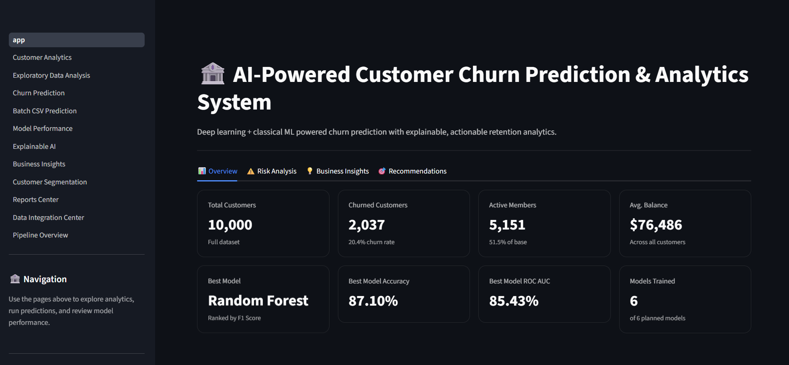

---

### 📊 Customer Analytics

Analyze customer demographics, financial behavior, engagement metrics, and account activity through interactive visualizations.

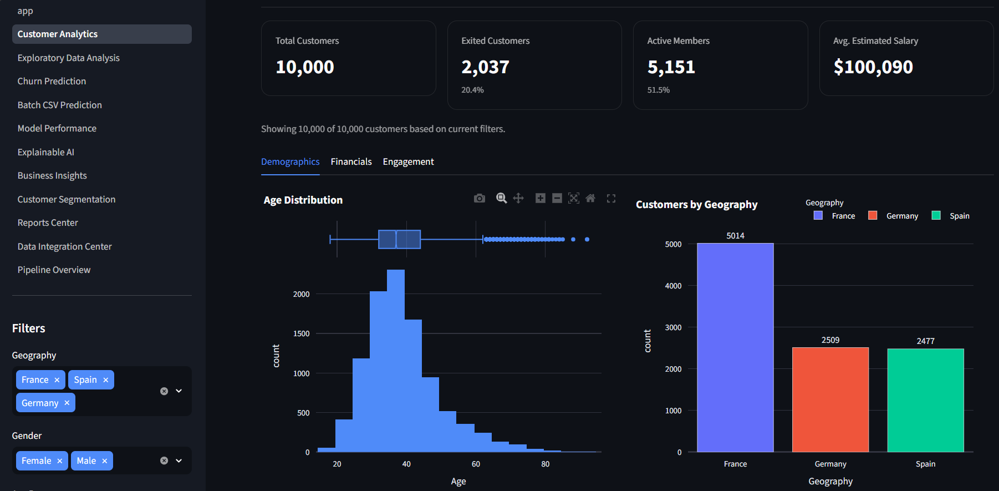

---

### 🔍 Exploratory Data Analysis

Perform univariate, bivariate, correlation, pairplot, and outlier analysis to understand customer behavior patterns.

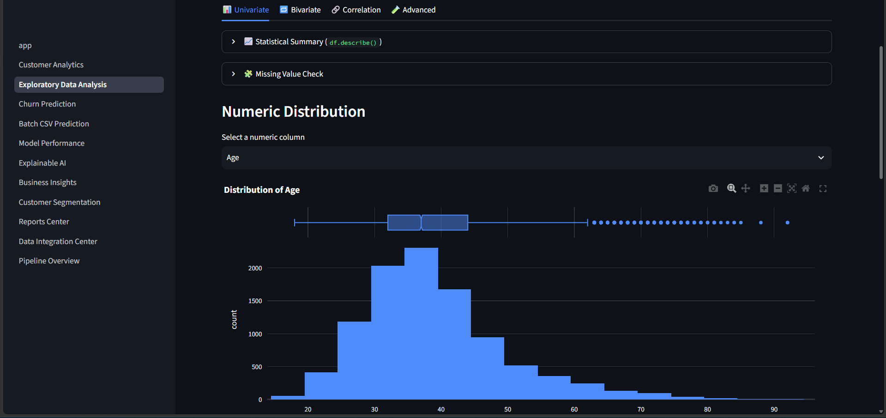

---

### 🎯 Churn Prediction

Predict churn probability for an individual customer using the selected machine learning or deep learning model.

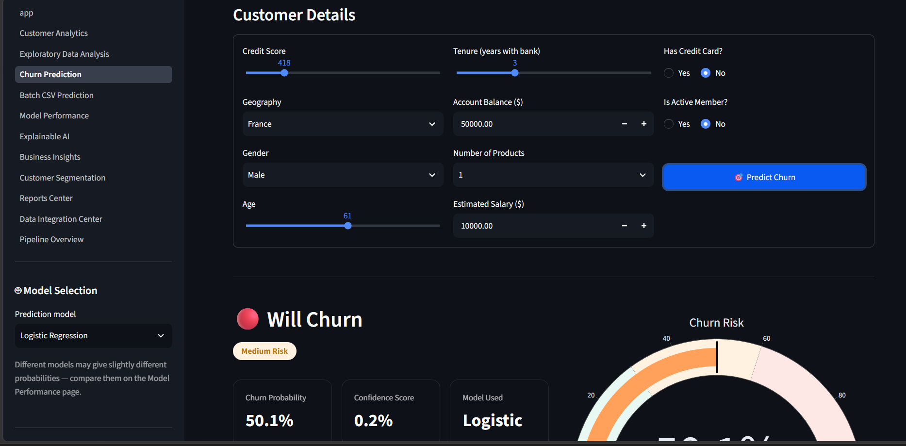

---

### 📁 Batch CSV Prediction

Upload customer datasets and generate bulk churn predictions with downloadable reports.

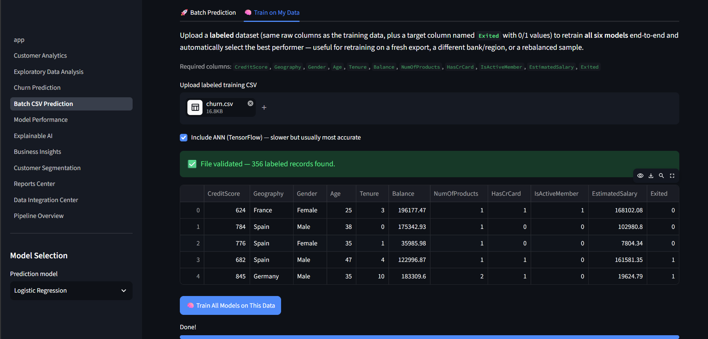

---

### 📈 Model Performance

Compare all trained models using Accuracy, Precision, Recall, F1-Score, ROC-AUC, Lift, Gain, and Radar charts.

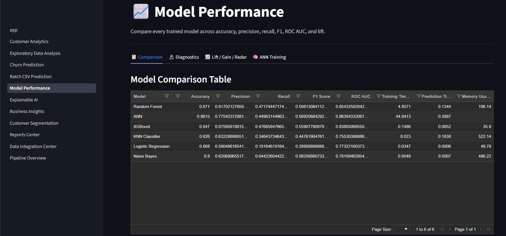

---

### 🧠 Explainable AI

Understand prediction decisions using SHAP feature importance, waterfall plots, and force plots.

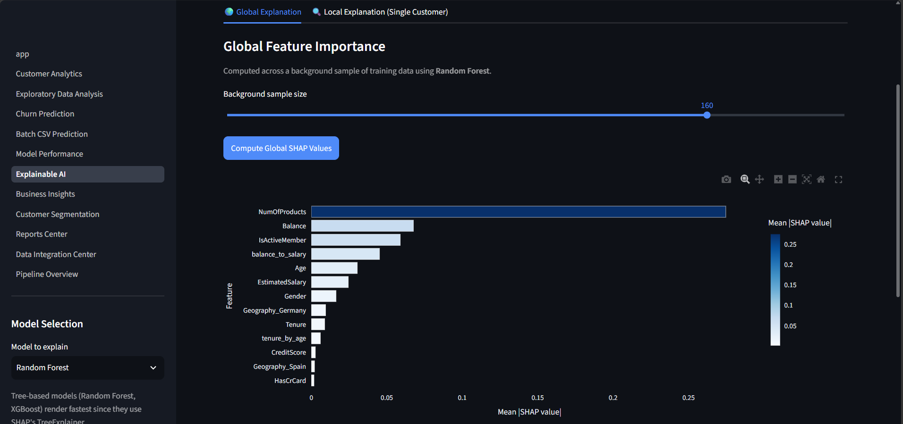

---

### 💡 Business Insights

Identify revenue risk, customer value segments, and actionable retention opportunities.

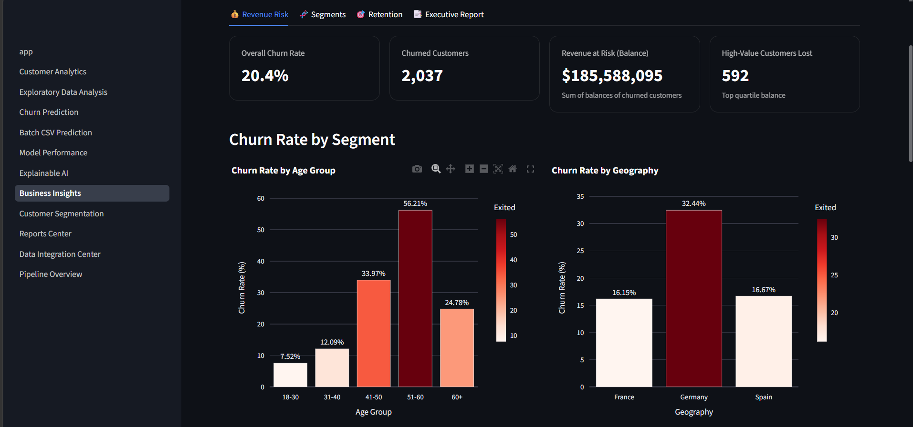

---

### 🧬 Customer Segmentation

Group customers into business personas using KMeans clustering and visualize segment characteristics.

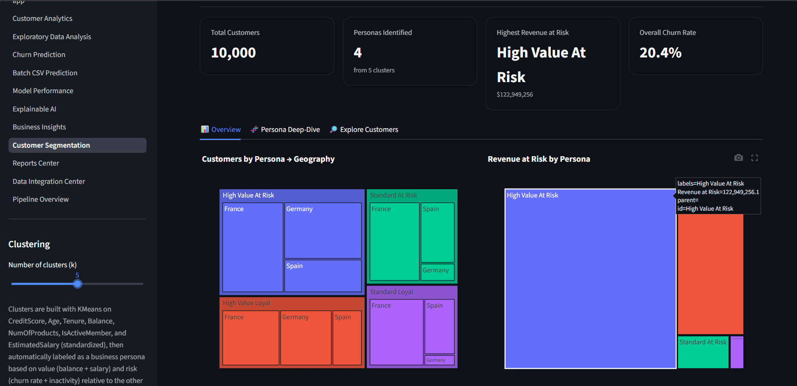

---

### 📑 Reports Center

Generate and download PDF, Excel, and CSV reports for stakeholders and business teams.

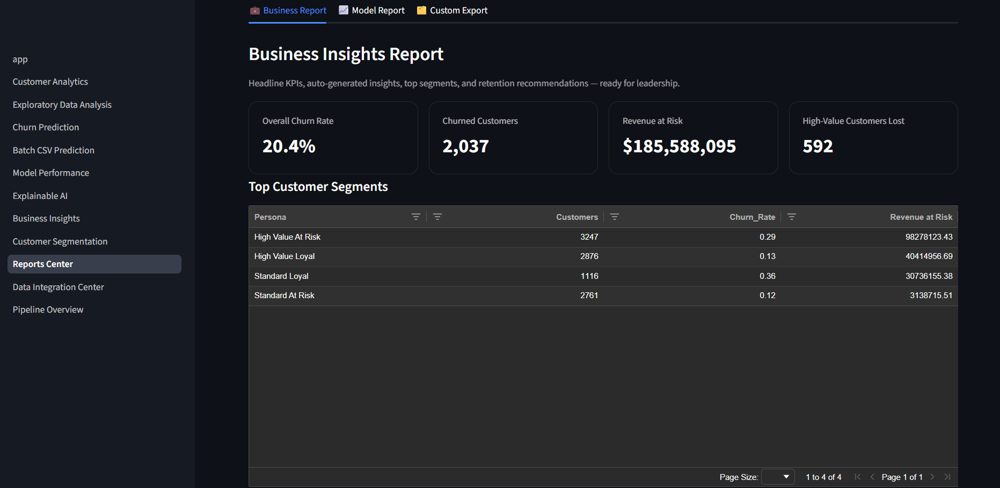

---

### 🧮 Data Integration Center

Validate uploaded datasets, check schema compatibility, detect missing values, and audit data quality.

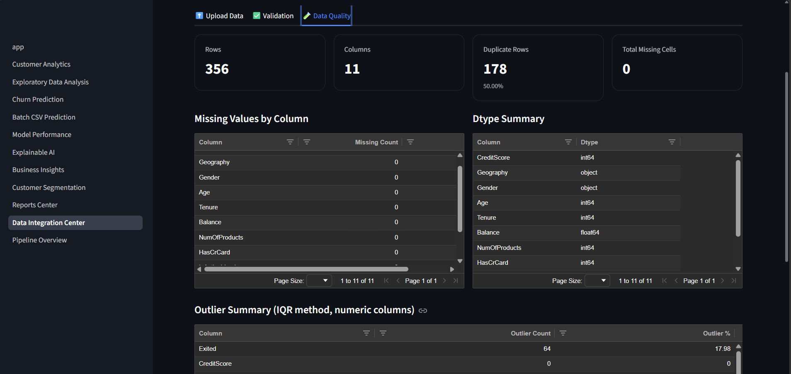

---


## 👨‍💻 Resume Highlights

- Built a 6-model ML/DL comparison pipeline (Logistic Regression, KNN, Naive Bayes, Random Forest,
  XGBoost, ANN) with a fully reproducible, modular training pipeline.
- Designed and implemented a **12-page, tabbed** interactive Streamlit analytics dashboard with 30+
  live visualizations (Plotly), including an executive dashboard, KMeans customer segmentation, and
  a live AI/ML pipeline diagram.
- Integrated SHAP-based Explainable AI for global, local waterfall, and local force-plot explanations.
- Implemented **KMeans customer segmentation** with automatic persona labeling to prioritize
  retention spend by value and risk.
- Added **lift/gain curve** and per-model **radar chart** diagnostics for business-facing model
  evaluation, beyond standard ROC/PR curves.
- Built a **Reports Center** producing PDF, CSV, and multi-sheet Excel exports, and a **Data
  Integration Center** for schema validation and data-quality auditing of new data.
- Added an AI-generated natural-language prediction summary (with optional LLM integration via the
  Anthropic API) and one-click PDF exports for both individual predictions and business reports.
- Built a batch CSV prediction pipeline supporting bulk scoring and CSV export for business teams.
- Exposed all functionality through a documented FastAPI REST service (`/predict`, `/batch_predict`,
  `/metrics`, `/health`).
- Authored production-quality, PEP8-compliant, fully type-hinted and docstring-documented Python
  across a 25+ module codebase.

---

## 📂 Project Status

✅ Data Preprocessing · ✅ EDA (tabbed, with pairplots) · ✅ Feature Engineering · ✅ Feature Scaling ·
✅ 6 Models Trained & Compared · ✅ KMeans Customer Segmentation · ✅ Tabbed Executive Dashboard ·
✅ Explainable AI (waterfall + force plot) · ✅ Lift/Gain/Radar Diagnostics · ✅ Batch Prediction ·
✅ Reports Center (CSV/Excel/PDF) · ✅ Data Integration Center · ✅ AI/ML Pipeline Diagram ·
✅ Interactive AgGrid Tables · ✅ REST API · ✅ Documentation

## 👨‍💻 Made By

**Ronaksinh Rathod**

## ⭐ Support

If you found this project useful, consider giving it a star ⭐ on GitHub.
=======

